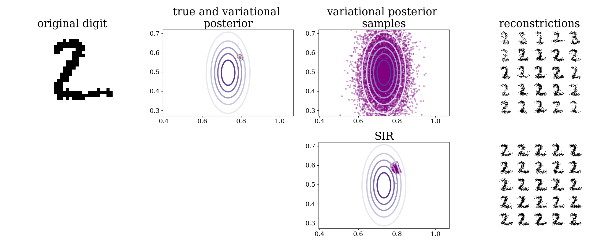
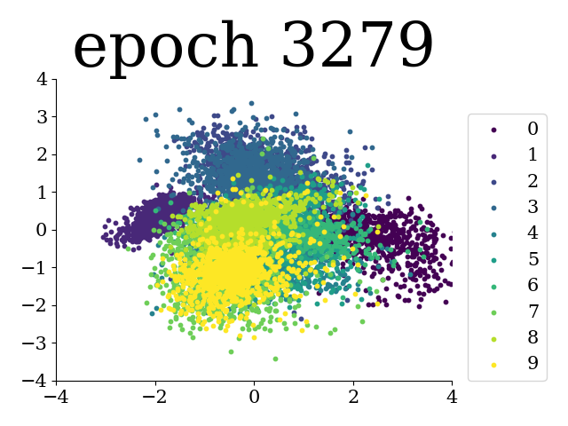
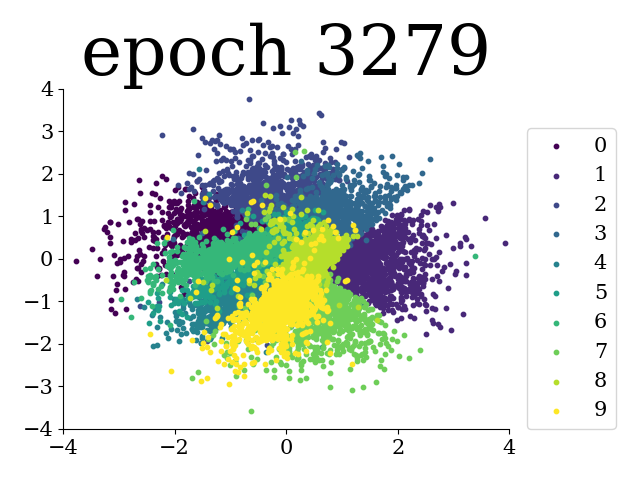
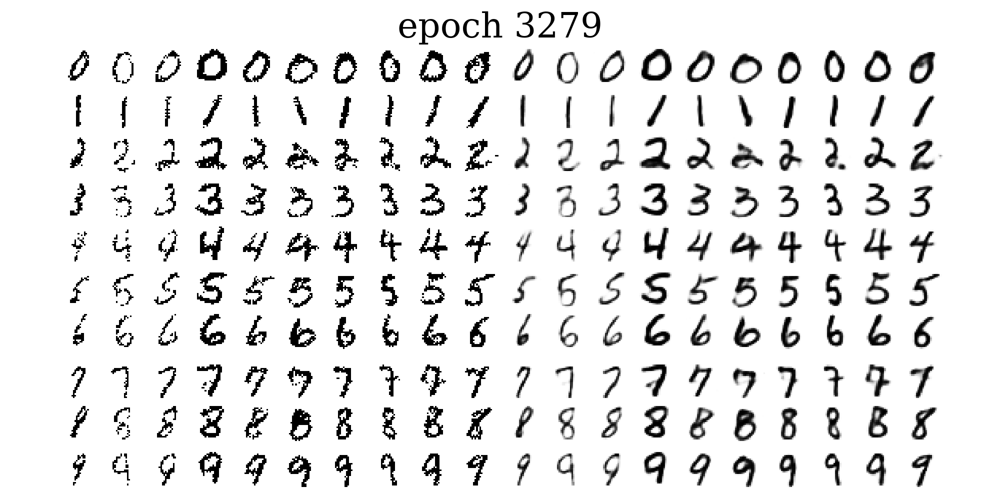

# Importance Weighted Autoencoders in TensorFlow 2

Reproducing results from the [IWAE paper](https://arxiv.org/pdf/1509.00519.pdf) in TensorFlow 2. 

## Results
Samples (left) and mean function (right) when sampling from the prior, during training of an IWAE with 50 importance samples.    


Test-set log likelihoods as estimated using k=5000 importance samples:

#### 1 stochastic layer
| Method | Test-set LLH | Test-set LLH ([original paper](https://arxiv.org/pdf/1509.00519.pdf)) |
| --- | --- | --- |
| IWAE k=1 | -86.35 | -86.76 |
| IWAE k=5 | -85.18 | -85.54 |
| IWAE k=50 | -84.59 | -84.78 |

#### 2 stochastic layers
| Method | Test-set LLH (this repo) | Test-set LLH ([original paper](https://arxiv.org/pdf/1509.00519.pdf)) |
| --- | --- | --- |
| IWAE k=1 | -84.83 | -85.33 |
| IWAE k=5 | -83.48 | -83.89 |
| IWAE k=50 | -82.82 | -82.90 |

## Usage
The results for the IWAE with 1 or 2 stochastic layers and 1, 5 or 50 importance samples can be obtained by running `main.py` as
``` 
python main.py --n_samples          <# of importance samples, 5 by default>  
               --objective          <choose iwae_elbo or vae_elbo, iwae_elbo by default>
               --stochastic_layers  <# of stochastic layers, 1 by default>
```
The model is investigated further in a series of tasks found in `./tasks`.  
`task01.py`: Use a 2D latent space to investigate both true and variational posteriors. We can use *self-normalized importance sampling* to estimate posterior means and *sampling importance resampling* to draw samples from the true posterior.  
`task02.py`: Apply the Doubly Reparameterized Gradient Estimator, [DReG](https://arxiv.org/pdf/1810.04152.pdf), to the original experiment.  
`task03.py`: Investigates the latent spaces of an IWAE with two stochastic layers.
`task04.py`: Extend the experiment in `main.py` to a conditional IWAE, conditioned on the image labels.

# Additional results:
## DReG estimator, 1 stochastic layer
The Doubly Reparameterized Gradient Estimator for Monte Carlo Objectives, [DReG](https://arxiv.org/pdf/1810.04152.pdf), provides even lower variance gradients for the inference network, than just using the reparameterization trick. This is implemented in `task02.py`.  

| Method | DReG Test-set LLH | Standard IWAE Test-set LLH |
| --- | --- | --- |
| IWAE k=1 | -86.08 | -86.35 |
| IWAE k=5 | -84.90 | -85.18 |
| IWAE k=50 | -84.32 | -84.59 |

## Variational and true posteriors
In an IWAE with a 2D latent space we can inspect the true posterior, by evaluating it over a grid. This is done in `task01.py`.  
In the two left most plots below are shown a digit from the test-set alongside its true and variational posteriors. The variational posterior is axis aligned and usually covers the more complex true posterior. To the right are shown samples from the variational posterior and reconstructions of some of these. The bottom row shows how *sampling importance resampling*, using the self-normalized importance weights, can provide samples from the true posterior.   



## Latent representations with 2 stochastic layers
In `task03.py` we fit an IWAE with 2 stochastic layers of dimension 4 and 2 respectively. The (PCA of) the latent representations are seen below. The expectation of the latent representations are obtained using self-normalized importance sampling. The first layer to the left and the second layer to the right.

 

## Regular VAE results 
By running `main.py` with `--objective vae_elbo` the VAE results from the IWAE paper can be reproduced.
### 1 stochastic layer VAE
| Method | Test-set LLH (this repo) | Test-set LLH ([original paper](https://arxiv.org/pdf/1509.00519.pdf)) |
| --- | --- | --- |
| VAE k=1 | -86.35 | -86.76 |
| VAE k=5 | -86.10 | -86.47 |
| VAE k=50 | -86.06 | -86.35 |

### 2 stochastic layers VAE
| Method | Test-set LLH (this repo) | Test-set LLH ([original paper](https://arxiv.org/pdf/1509.00519.pdf)) |
| --- | --- | --- |
| VAE k=1 | -84.83 | -85.33 |
| VAE k=5 | -84.08 | -85.01 |
| VAE k=50 | -83.89 | -84.78 |

## CVAE 1 stochastic layer
The [Conditional VAE](https://proceedings.neurips.cc/paper/2015/file/8d55a249e6baa5c06772297520da2051-Paper.pdf) (IWAE in this case) can be coditioned on some context, in this case the image labels. The prior can be the usual prior (`task05.py`) or conditional on the label as well (`task04.py`). In these results the prior is conditional on the label.

| Method | Test-set LLH |
| --- | --- | 
| CIWAE k=1 | -82.32 | 
| CIWAE k=5 | -81.41 | 
| CIWAE k=50 | -80.78 | 
  


## TODO:
Investigate active units  

## Resources:
https://github.com/yburda/iwae  
https://arxiv.org/pdf/1509.00519.pdf  
https://github.com/addtt/ladder-vae-pytorch  
https://github.com/xqding/Importance_Weighted_Autoencoders  
https://github.com/xqding/AIWAE  
https://github.com/ShwanMario/IWAE  
https://github.com/AntixK/PyTorch-VAE  
https://paperswithcode.com/paper/importance-weighted-autoencoders  
https://github.com/casperkaae/LVAE/blob/master/run_models.py  
https://github.com/yoonholee/pytorch-vae  
https://github.com/abdulfatir/IWAE-tensorflow  
https://github.com/larsmaaloee/BIVA
https://github.com/vlievin/biva-pytorch    
https://github.com/casperkaae/parmesan  
https://github.com/casperkaae/LVAE/blob/master/run_models.py  
https://github.com/neha191091/IWAE/blob/master/iwae/experiments.py  
https://github.com/jmtomczak/vae_vampprior  
https://github.com/harvardnlp/sa-vae  
https://arxiv.org/pdf/1602.02282.pdf  
https://arxiv.org/pdf/1802.04537.pdf  
https://arxiv.org/pdf/1810.04152.pdf  
https://arxiv.org/pdf/1902.02102.pdf  


### Two stochastic layers
[xqding](https://github.com/xqding/Importance_Weighted_Autoencoders/blob/master/model/vae_models.py)  
[ShwanMario](https://github.com/ShwanMario/IWAE)  
[addtt](https://github.com/addtt/ladder-vae-pytorch)  
[Ladder VAE](https://arxiv.org/pdf/1602.02282.pdf) and accompanying [github](https://github.com/casperkaae/LVAE)  