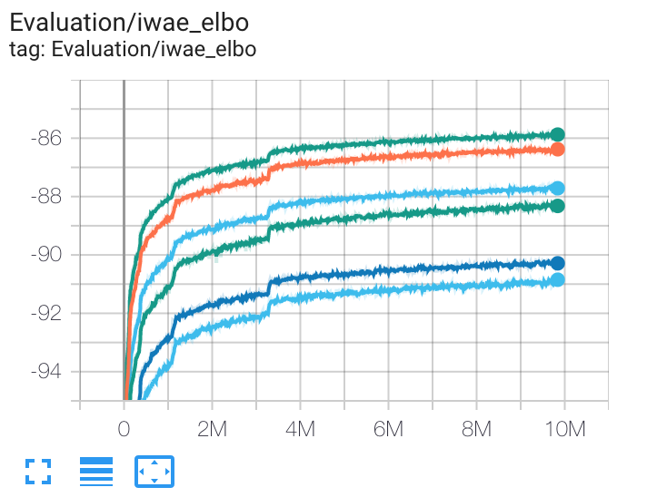

# IWAE

Reproducing results from the [IWAE paper](https://arxiv.org/pdf/1509.00519.pdf) in TensorFlow 2. 

## Usage
The results for the model with 1 stochastic layer and 1, 5 or 50 importance samples can be obtained by running `main.py` with the default settings, adjusting the number of samples.
``` 
python main.py --n_samples          <# of importance samples, 5 by default>  
               --objective          <choose vae_elbo or iwae_elbo, iwae_elbo by default>
               --stochastic_layers  <# of stochastic layers, 1 by default>
```
The model is investigated further in a series of tasks found in `./tasks`

## Results
Samples (left) and mean function (right) when sampling from the prior, during training of an IWAE with 50 importance samples.  


Test-set log likelihoods are estimated using 5000 importance samples

#### 1 stochastic layer
| Method | Test-set LLH (this repo) | Test-set LLH ([original paper](https://arxiv.org/pdf/1509.00519.pdf)) |
| --- | --- | --- |
| 1 | -86.35 | -86.76 |
| 5 | -85.18 | -85.54 |
| 50 | -84.59 | -84.78 |

#### 2 stochastic layers
| Method | Test-set LLH (this repo) | Test-set LLH ([original paper](https://arxiv.org/pdf/1509.00519.pdf)) |
| --- | --- | --- |
| 1 | -84.83 | -85.33 |
| 5 | -83.48 | -83.89 |
| 50 | -82.82 | -82.90 |

#### DReG estimator, 1 stochastic layer
The Doubly Reparameterized Gradient Estimator for Monte Carlo Objectives, [DReG](https://arxiv.org/pdf/1810.04152.pdf), provides even lower variance gradients for the inference network, than just using the reparameterization trick. This is implemented in `task02.py`.  

| Method | DReG Test-set LLH | Standard IWAE Test-set LLH |
| --- | --- | --- |
| 1 | -86.08 | -86.35 |
| 5 | -84.90 | -85.18 |
| 50 | -84.32 | -84.59 |

## Tasks
`main.py`: original experiment with 1 or 2 stochastic layers.  
`task01.py`: Use a 2D latent space to investigate both true and variational posteriors. We can use *self-normalized importance sampling* to estimate posterior means and *sampling importance resampling* to draw samples from the true posterior.  
`task02.py`: Use the Double Reparameterized Gradient Estimator, [DReG](https://arxiv.org/pdf/1810.04152.pdf), to the original experiment.  

## Comparisons
A number of other repositories have reproduced results from the IWAE paper, see for example  
- The original code acompanying the paper [yburda](https://github.com/yburda/iwae)  
- [abdulfatir](https://github.com/abdulfatir/IWAE-tensorflow)  
- [shwanmario](https://github.com/ShwanMario/IWAE)  
- [xqding](https://github.com/xqding/Importance_Weighted_Autoencoders)
- [yoonholee](https://github.com/yoonholee/pytorch-vae)

## TODO:
Display true and variational posteriors in 2D latent space  
Active units  

Note that pytorch dataloaders makes it easier to work with dynamically binarized mnist, see [xqding](https://github.com/xqding/Importance_Weighted_Autoencoders/blob/master/model/vae_models.py)

# Additional results:
#### 1 stochastic layer VAE
| Method | Test-set LLH (this repo) | Test-set LLH ([original paper](https://arxiv.org/pdf/1509.00519.pdf)) |
| --- | --- | --- |
| VAE 1 | -86.35 | -86.76 |
| VAE 5 | -86.10 | -86.47 |
| VAE 50 | -86.06 | -86.35 |

#### 2 stochastic layers VAE
| Method | Test-set LLH (this repo) | Test-set LLH ([original paper](https://arxiv.org/pdf/1509.00519.pdf)) |
| --- | --- | --- |
| VAE 1 | -84.83 | -85.33 |
| VAE 5 | -84.08 | -85.01 |
| VAE 50 | -83.89 | -84.78 |

#### Test-set lower bounds during training: IWAE with DReG vs regular IWAE
Test-set lower bounds for 1, 5 and 50 importance samples, with DReG and without. 


## Using warm-up, as suggested in [LVAE](https://arxiv.org/pdf/1602.02282.pdf)
#### IWAE equation (8) with warm-up
| Method | Test-set LLH (this repo) | Test-set LLH ([original paper](https://arxiv.org/pdf/1509.00519.pdf)) |
| --- | --- | --- |
| 1 |  | -86.76 |
| 5 |  | -85.54 |
| 50 |  | -84.78 |


#### Standard VAE with warmup
| Method | Test-set LLH (this repo) | Test-set LLH ([original paper](https://arxiv.org/pdf/1509.00519.pdf)) |
| --- | --- | --- |
| 1 |  | -86.76 |
| 5 |  | -86.46 |
| 50 |  | -86.35 |


## Resources:
https://github.com/yburda/iwae  
https://arxiv.org/pdf/1509.00519.pdf  
https://github.com/addtt/ladder-vae-pytorch  
https://github.com/xqding/Importance_Weighted_Autoencoders  
https://github.com/xqding/AIWAE  
https://github.com/ShwanMario/IWAE  
https://github.com/AntixK/PyTorch-VAE  
https://paperswithcode.com/paper/importance-weighted-autoencoders  
https://github.com/casperkaae/LVAE/blob/master/run_models.py  
https://github.com/yoonholee/pytorch-vae  
https://github.com/abdulfatir/IWAE-tensorflow  
https://github.com/larsmaaloee/BIVA
https://github.com/vlievin/biva-pytorch    
https://github.com/casperkaae/parmesan  
https://github.com/casperkaae/LVAE/blob/master/run_models.py  
https://github.com/neha191091/IWAE/blob/master/iwae/experiments.py  
https://github.com/jmtomczak/vae_vampprior  
https://github.com/harvardnlp/sa-vae  
https://arxiv.org/pdf/1602.02282.pdf  
https://arxiv.org/pdf/1802.04537.pdf  
https://arxiv.org/pdf/1810.04152.pdf  
https://arxiv.org/pdf/1902.02102.pdf  


### Two stochastic layers
See 
- [xqding](https://github.com/xqding/Importance_Weighted_Autoencoders/blob/master/model/vae_models.py)  
- [ShwanMario](https://github.com/ShwanMario/IWAE)
- [addtt](https://github.com/addtt/ladder-vae-pytorch)
- [Ladder VAE](https://arxiv.org/pdf/1602.02282.pdf) and accompanying [github](https://github.com/casperkaae/LVAE)